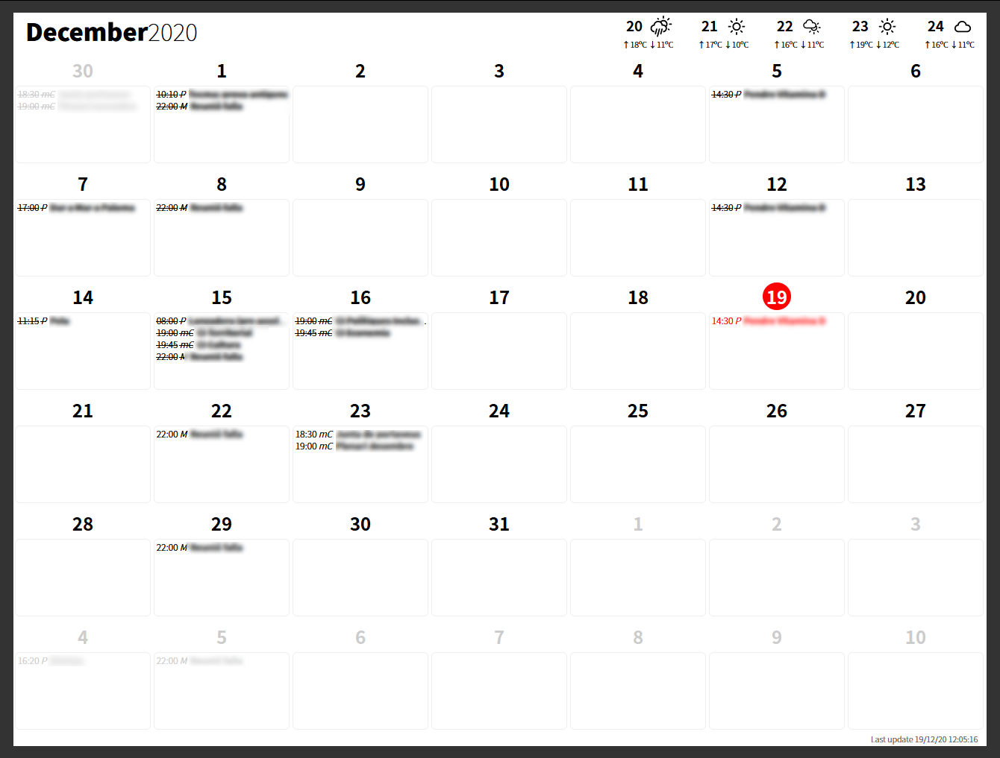

# familycalendar

Show the family calendar on a eInk screen

Heavily inspired by https://www.reddit.com/r/RASPBERRY_PI_PROJECTS/comments/dzveio/seeking_advice_on_wallmounted_battery_powered/

## Disclaimer

My very first Python project.

I've expertise in software development, from Clipper (MS-DOS), TurboPascal, Delphi, PHP, JavaScript, and others, but in Python that's my first try to do something usable.
